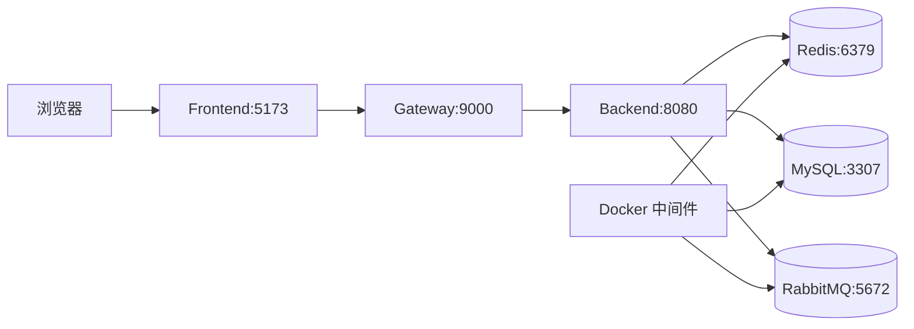

# High-Concurrency Seckill System / 高并发秒杀系统

基于 **Spring Boot + Redis + RabbitMQ + Spring Cloud Gateway** 的高并发秒杀系统，模拟 1000 并发用户抢购 100 件商品。适用于学习分布式缓存、消息削峰、网关限流与防刷等场景。

## Features

- **防超卖**：Redis Lua 脚本原子预扣库存
- **削峰填谷**：RabbitMQ 异步下单，消费者 Redisson 限速 200 QPS，DB 负载降低约 75%
- **网关防护**：令牌桶限流 + IP/用户/指纹防刷
- **集群一致**：Redisson 分布式锁保证多实例 DB 落库互斥
- **密码安全**：MD5 + Salt 加密存储

## Tech Stack

| 层级 | 技术 |
|------|------|
| 后端 | Spring Boot 3.2、MyBatis-Plus、Spring Security + JWT |
| 缓存 | Redis + Lua 脚本原子扣库存 |
| 消息队列 | RabbitMQ 削峰填谷 |
| 分布式 | Redisson 分布式锁 + 令牌桶限流 |
| 网关 | Spring Cloud Gateway（防刷 + 限流） |
| 前端 | Vue 3 + Element Plus + Vite |
| 部署 | Docker + Nginx |

## Architecture



## 服务与端口

| 服务 | 端口 | 开发访问地址 | Docker 容器 |
|------|------|--------------|-------------|
| Frontend (Vite) | 5173 | http://localhost:5173 | - |
| Gateway | 9000 | http://localhost:9000/api | seckill-gateway |
| Backend | 8080 | http://localhost:8080/api | seckill-app（内部） |
| MySQL | 3307→3306 | localhost:3307 | seckill-mysql |
| Redis | 6379 | localhost:6379 | seckill-redis |
| RabbitMQ | 5672 | - | seckill-rabbitmq |
| RabbitMQ 管理台 | 15672 | http://localhost:15672 | seckill-rabbitmq |
| Nginx | 80 | http://localhost | seckill-nginx |

> Docker MySQL 映射 **3307**，避免与宿主机 MySQL 占用 3306 冲突。RabbitMQ 管理台默认账号 guest / guest。

## Prerequisites

| 类别 | 工具 | 版本要求 | 用途 |
|------|------|----------|------|
| 语言运行时 | JDK | 17+ | 后端、网关 |
| 构建 | Maven | 3.9+ | Java 模块编译运行 |
| 前端 | Node.js + npm | 18+ | Vite 开发服务器 |
| 容器 | Docker Desktop | 最新稳定版 | MySQL / Redis / RabbitMQ |
| 可选压测 | Apache JMeter | 5.x | 见 [deploy/jmeter/README.md](deploy/jmeter/README.md) |
| 可选 IDE | IntelliJ IDEA / VS Code | - | 开发调试（IDEA 需 **JDK 17**、**Lombok** 插件；一键全栈需 **Node.js** 以运行 npm 配置） |
| 可选 API | curl / Postman | - | 接口调试 |

## IntelliJ IDEA 开发（推荐）

本地开发优先用 IDEA **一键 Run**，无需开多个终端。终端多窗口启动见下文「终端启动（备选）」。

### 打开正确的项目根（常见坑）

| 打开路径 | 结果 |
|----------|------|
| **`seckill-system`**（含根 `pom.xml`、`docker-compose.yml`） | 正确：Maven 识别、可 Run |
| 外层 `High-Concurrency Seckill System` 等父文件夹 | 错误：`pom.xml` 无 Maven 图标、无 Run 按钮 |

**File → Open** 务必选到 **`seckill-system`** 这一层。

### 首次运行（一次性准备）

按顺序完成以下步骤：

| 步骤 | 操作 |
|------|------|
| 1. Docker | 安装并启动 **Docker Desktop**（建议设置开机自启） |
| 2. 中间件 | 在项目根执行 `.\deploy\start-dev.ps1`，或 `docker compose up -d --build mysql redis rabbitmq` |
| 3. 前端依赖 | `cd seckill-frontend && npm install`（**仅首次**，否则 5173 无法启动） |
| 4. IDEA 环境 | **Project Structure → SDK = JDK 17**；安装 **Lombok** 插件；**Annotation Processing** 开启 |
| 5. Maven | 等待导入完成（右侧 **Maven** 面板可见 `seckill-backend`） |

中间件成功标志：`docker compose ps` 中 mysql / redis / rabbitmq 均为 **Up**，MySQL 为 **healthy**。

> MySQL 使用 [deploy/mysql/Dockerfile](deploy/mysql/Dockerfile) 将 `schema.sql` 打入镜像，避免桌面路径（中文、空格）导致 Docker 挂载失败。首次或 schema 变更后需加 **`--build`**。

### 以后每次运行（日常）

```
Docker 中间件已 Up → Run SeckillApplication → 打开 http://localhost:5173
```

1. 确认 **Docker Desktop** 在运行，且中间件容器为 Up（`restart: unless-stopped` 下多数时候会自动保持）
2. 打开 [SeckillApplication.java](seckill-backend/src/main/java/com/seckill/SeckillApplication.java) → 点击 **Run**
3. Run 配置会在后台依次启动：**Gateway（9000）**、**Frontend Dev（5173）**、**Backend（8080）**

**成功标志：**

- 后端控制台：`Started SeckillApplication`、`Redis 库存预热完成`
- 网关控制台：`Started GatewayApplication`、`Netty started on port 9000`
- **Frontend Dev** 标签页：`Local: http://localhost:5173/`

### 可选：仅调试后端（不启网关/前端）

默认无需修改。仅在调试 API、使用 Swagger 时，可在 **Run → Edit Configurations → SeckillApplication** 中移除 Before Launch 的 Gateway / Frontend Dev，然后访问 `http://localhost:8080/api` 或 Swagger。

### 访问说明（避免误判为故障）

| 地址 | 说明 |
|------|------|
| http://localhost:5173 | **主入口**：注册 → 登录 → 秒杀 |
| http://localhost:9000/api/products | 经网关，**无需登录** |
| http://localhost:8080/api/products | 直连后端，**无需登录** |
| http://localhost:8080/swagger-ui/index.html | Swagger（**仅 8080**，网关不转发 Swagger） |
| http://localhost:9000/api 或 `/api` 根路径 | 需 JWT → 返回 **401 是正常现象** |
| http://localhost:15672 | RabbitMQ 管理台（guest / guest） |

### IDEA Run 配置说明

项目已包含 `.idea/runConfigurations/`：

- **SeckillApplication**：后端 + Before Launch 拉起网关与前端
- **GatewayApplication** / **Frontend Dev**：可单独运行

若 Run 仍使用 **Java 23**，在 **Run → Edit Configurations → SeckillApplication → JRE** 选 **corretto-17**（或 JDK 17）。

### 5173 拒绝连接时自检

`localhost:5173` 报 **ERR_CONNECTION_REFUSED** 表示 **Vite 前端没在跑**，按下面排查：

1. **是否已 `npm install`**：确认 `seckill-frontend/node_modules` 存在；没有则执行 `cd seckill-frontend && npm install`
2. **Run 窗口是否有 Frontend Dev 标签**：没有则说明一键全栈未触发前端；可单独 **Run → Frontend Dev** 试一次
3. **Frontend Dev 日志**：应出现 `Local: http://localhost:5173/`；若有 npm 报错，按提示修复
4. **Run 配置是否用对**：顶部下拉选 **SeckillApplication**（来自 `.idea/runConfigurations/`，含 Before Launch）；若 IDEA 自动生成过无 Before Launch 的副本，在 **Edit Configurations** 中删除重复项，或 **File → Invalidate Caches → Restart** 后重开项目

---

## 终端启动（备选）

**适用：** 不使用 IDEA 时。**IDEA 用户请用上文一键 Run，无需本节。**

无论 IDEA 还是终端，都需先启动 **Docker 中间件**；应用部分需在 **3 个终端分别** 启动后端、网关、前端：

```
中间件（1 次） → 终端1 后端(8080) → 终端2 网关(9000) → 终端3 前端(5173)
```

### 1. 中间件（项目根）

**Windows（推荐脚本）：**

```powershell
.\deploy\start-dev.ps1
```

**手动（Windows / Linux / macOS）：**

```bash
docker compose up -d --build mysql redis rabbitmq
docker exec seckill-redis redis-cli ping   # 应返回 PONG
docker compose ps                          # mysql 应为 healthy
```

### 2. 后端（终端 1）

```bash
cd seckill-backend
mvn spring-boot:run
```

成功标志：日志出现 `Started SeckillApplication`、`Redis 库存预热完成`。

### 3. 网关（终端 2）

```bash
cd seckill-gateway
mvn spring-boot:run
```

成功标志：日志出现 `Started GatewayApplication`，端口 **9000** 监听。

### 4. 前端（终端 3）

```bash
cd seckill-frontend
npm install    # 仅首次
npm run dev
```

访问 http://localhost:5173。库存预热通常在后端启动时自动完成；手动预热见 [deploy/jmeter/README.md](deploy/jmeter/README.md)。

## 开发与调试

访问地址见上文 **「访问说明」**。

### 重启后端

修改 Java 代码或 `application.yml` 后需重启后端。若出现 `Port 8080 was already in use`：

1. 在运行后端的终端按 `Ctrl+C` 停止旧进程
2. Windows：`netstat -ano | findstr ":8080"` 查 PID 后结束进程
3. 再执行 `mvn spring-boot:run`

### MQ 与脏数据

后端或 MQ 序列化配置变更后，建议清空旧消息：

```bash
docker exec seckill-rabbitmq rabbitmqctl purge_queue seckill.order.queue
```

开发环境修复卡住订单、商品名乱码，见 [deploy/fix-stuck-orders.sql](deploy/fix-stuck-orders.sql)。

### 切换测试账号

1. 点击顶栏「退出 (用户名)」
2. 使用另一账号登录

登录成功后顶栏用户名通过 `auth-changed` 事件刷新（见 `seckill-frontend/src/composables/auth.js`）。

## Docker 全栈部署

适用于单机演示或压测，包含 MySQL、Redis、RabbitMQ、后端、网关、Nginx。

### 1. 构建前端

```bash
cd seckill-frontend
npm install
npm run build
cd ..
```

构建产物位于 `seckill-frontend/dist/`，由 Nginx 挂载为静态资源。

### 2. 启动全栈

```bash
docker compose up -d --build --scale seckill-app=2
```

- `seckill-app=2`：启动 2 个后端实例（集群演示）
- 仅中间件 + 本地 Java 开发：`docker compose up -d --build mysql redis rabbitmq`

### 3. 预热库存

见 [deploy/jmeter/README.md](deploy/jmeter/README.md)（Linux/macOS 用 `curl`，Windows PowerShell 用 `Invoke-RestMethod`）。

### 4. 访问

| 入口 | 地址 |
|------|------|
| 用户界面（Nginx） | http://localhost |
| API 网关 | http://localhost:9000/api |

### 环境变量

来自 [docker-compose.yml](docker-compose.yml)：

**seckill-app（后端）**

| 变量 | 默认值 | 说明 |
|------|--------|------|
| MYSQL_HOST | mysql | MySQL 主机 |
| MYSQL_PORT | 3306 | 容器内端口 |
| MYSQL_USER | root | 数据库用户 |
| MYSQL_PASSWORD | seckill123 | 数据库密码 |
| REDIS_HOST | redis | Redis 主机 |
| RABBITMQ_HOST | rabbitmq | RabbitMQ 主机 |
| JWT_SECRET | （见 compose） | JWT 签名密钥 |

**seckill-gateway（网关）**

| 变量 | 默认值 | 说明 |
|------|--------|------|
| BACKEND_URI | http://seckill-app:8080 | 后端地址 |
| REDIS_HOST | redis | 限流/防刷 Redis |

本地 `mvn spring-boot:run` 时，后端默认连接 `localhost:3307`（MySQL）、`localhost:6379`（Redis），见 `seckill-backend/src/main/resources/application.yml`。

### Nginx 与网关

- Nginx 提供 `seckill-frontend/dist` 静态文件
- `/api` 请求转发至 `seckill-gateway:9000`
- 开发模式下前端 Vite 将 `/api` 代理到 `http://localhost:9000`（见 `vite.config.js`）

### 生产注意事项

1. **修改默认密码**：MySQL `MYSQL_ROOT_PASSWORD`、JWT `JWT_SECRET` 必须使用强随机值
2. **勿提交密钥**：使用环境变量或密钥管理，不要写入 Git
3. **HTTPS**：生产环境在 Nginx 或云负载均衡上配置 TLS
4. **数据备份**：MySQL 持久化卷与定期备份策略
5. **监控**：RabbitMQ 管理台、应用日志、Redis/MySQL 指标

Linux 自动化部署可参考 [deploy/deploy.sh](deploy/deploy.sh)（需根据环境调整路径与权限）。

## API Reference

| 方法 | 路径 | 说明 |
|------|------|------|
| POST | /api/auth/register | 注册 |
| POST | /api/auth/login | 登录 |
| GET | /api/products | 商品列表 |
| POST | /api/seckill/{id} | 发起秒杀 |
| GET | /api/seckill/result/{id} | 查询结果 |
| GET | /api/orders | 我的订单 |
| POST | /api/admin/warmup | 库存预热 |

## 压测与并发验收

手工注册少量账号只能验证功能；**高并发与防超卖**需用 JMeter。脚本与逐步命令见 **[deploy/jmeter/README.md](deploy/jmeter/README.md)**。

| 场景 | 脚本 | 并发 | 环境 |
|------|------|------|------|
| 轻量压测 | `seckill-50users-100stock.jmx` | 45 恶意 + 5 合法 | IDEA 本地 + Docker 中间件 |
| 完整压测 | `seckill-1000users-100stock.jmx` | 950 恶意 + 50 合法 | Docker 多实例后端 |

**流程概要：** `prepare-users` 生成 Token → 预热库存 → 运行 JMX → MySQL 校验。

**验收标准：**

- 成功订单 `SELECT COUNT(*) FROM seckill_order WHERE status = 1` **≤ 100**（零超卖）
- JMeter 报告 Error% 偏高属正常（无 Token 请求计为 FAIL）；以 MySQL 与库存为准
- 完整压测：QPS ≥ 1200、平均 RT ≤ 180ms、恶意拦截率 ≥ 95%

**测试账号：** `testuser001`～`testuser050`，密码 `test123456`（压测专用，勿提交 `users.csv`）。

## Troubleshooting

### 环境与 IDE

| 错误 / 现象 | 原因 | 解决 |
|-------------|------|------|
| IDEA 中 `pom.xml` 是普通 XML、无 Run 按钮 | 打开了外层文件夹，未导入 Maven | **Open `seckill-system` 目录**（含根 `pom.xml`） |
| 依赖全红、无法解析 | Maven 未 Reload | Maven 面板点 **Reload All** |
| IDEA 日志显示 **Java 23** | Run 配置未绑 JDK 17 | **Run → Edit Configurations → JRE = corretto-17**；Project Structure → SDK 17 |
| Lombok getter/setter 报错 | 未装插件 | 安装 **Lombok** 插件 + 开启 **Annotation Processing** |

### Docker 与中间件

| 错误 / 现象 | 原因 | 解决 |
|-------------|------|------|
| `failed to connect to the docker API` | Docker Desktop 未运行 | 启动 Docker Desktop，等托盘显示 Running |
| `Docker is not running`（start-dev.ps1） | 同上 | 同上 |
| MySQL `error mounting` 桌面路径 | 路径含中文/空格，volume 挂载失败 | 使用 `deploy/mysql/Dockerfile` build 方式：`docker compose up -d --build mysql redis rabbitmq` |
| `Unable to connect to Redis server: localhost:6379` | Redis 未启动 | 先启动 Docker，再 `docker compose up -d redis` |
| `Communications link failure` (MySQL) | MySQL 未启动或未 ready | 等待 30s 或 `docker compose ps` 确认 **healthy** |
| `bind: 3306` 端口冲突 | 本机已有 MySQL 占用 3306 | Docker MySQL 已改映射 **3307**，后端默认连 `localhost:3307` |

### 应用启动

| 错误 / 现象 | 原因 | 解决 |
|-------------|------|------|
| `Unsupported character encoding 'utf8mb4'` | JDBC `characterEncoding` 误写 MySQL 字符集名 | 已改为 **UTF-8**（`application.yml`）；重启后端 |
| `Port 8080 was already in use` | 旧后端进程未退出 | IDEA **Stop**；Windows：`netstat -ano` 查 8080 端口 PID 后 `taskkill /PID <pid> /F` |
| 后端启动但 `库存预热失败` | 多为 MySQL 未就绪或编码问题 | 确认 MySQL healthy；检查上述 JDBC 配置 |
| `localhost:5173` 拒绝连接 | 前端未启动 | **首次**执行 `npm install`；查看 Run 窗口 **Frontend Dev** 是否报错 |
| 浏览器访问 `/api` 返回 **401** | 未登录访问受保护路径 | 正常；用 **5173 前端登录**，或访问 `/api/products` |
| Swagger 打开 `/swagger-ui.html` 为 401 | Security 放行 `/swagger-ui/**` | 使用 http://localhost:8080/swagger-ui/index.html |
| 网关 **429** 拦截所有请求 | 令牌桶限流过严 | 压测走网关；本地调试可直连 8080 |
| 订单一直「处理中」/ 商品名乱码 | MQ 历史脏数据 | 见 [deploy/fix-stuck-orders.sql](deploy/fix-stuck-orders.sql)；重启后端 |
| 顶栏用户名不随登录变化 | localStorage 非响应式（已修复） | 刷新前端；切换账号前建议点「退出」 |
| JMeter / 压测相关问题 | 见专文档 | [deploy/jmeter/README.md](deploy/jmeter/README.md) |

## Project Structure

```
seckill-system/             # Maven 根目录（IDEA Open 此目录）
├── .idea/runConfigurations/  # IDEA 一键 Run 配置（已纳入版本库）
├── seckill-backend/        # 后端服务
├── seckill-gateway/        # API 网关
├── seckill-frontend/       # Vue 前端
├── nginx/                  # Nginx 配置
├── deploy/
│   ├── start-dev.ps1       # Windows 中间件启动脚本
│   ├── mysql/Dockerfile    # MySQL 镜像（内置 schema.sql）
│   └── jmeter/             # JMeter 压测（prepare-users、50/1000 用户 jmx）
├── docker-compose.yml
└── LICENSE
```

> 若仓库外层还有 `High-Concurrency Seckill System` 等父文件夹，**不要**将其作为 IDEA 项目根打开。


## License

[MIT License](LICENSE)
